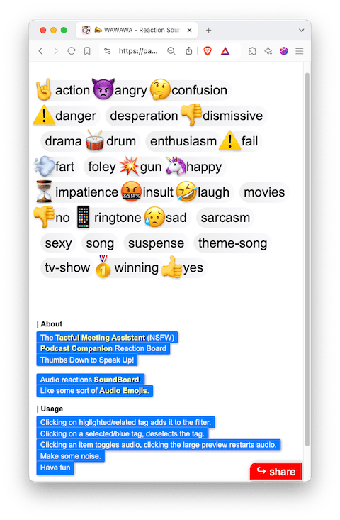
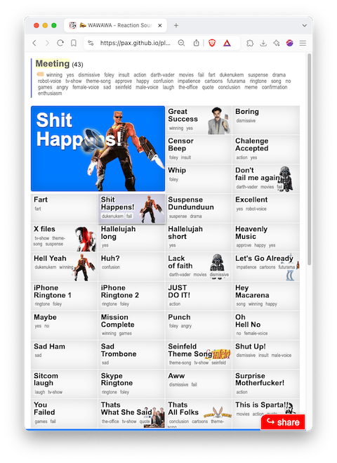

# WAWAWA - Reaction SoundBoard

Like reaction gifs / memes, but for sound

Prototype: [pax.github.io &rarr; wawawa](https://pax.github.io/playground/wawawa/) 

 

## Prior art
- [MyInstants.com](https://www.myinstants.com/) 
- [SoundBoard.com](https://www.soundboard.com/) 
- [SoundButtons.com](https://soundbuttonsworld.com/) 
- [Voicy](https://www.voicy.network) 
- [AKAspanion/music-app](https://github.com/AKAspanion/music-app) 
- [Somoji](https://github.com/ApoorvSaxena/Somoji) 
- see also: [YT mixer / mash-up](https://docs.google.com/document/d/1bWTh5fIsHL3iAnIx1BTs_ersVWhNiOSs) 

## Roadmap - HTML prototype

[pax.github.io &rarr; wawawa](https://pax.github.io/playground/wawawa/) 

- [x] download sample mp3s
- [x] create index file w tags
- [x] basic filtered list
- [x] url hash for ctg filter
- [x] file / audio permalink 
    - [x] showcase 1 audio
- [x] when clicking a tag where children have other tags, higlight those tags, when clicked, filter down. when other tag is clicked, reset to that one
- [x] show sound tags, other than the selection
- [ ] how to minimise clicks - shorten tag list? - some tags are secondary, different categories, source - leave in just the reaction subject, not attributes
- [x] add thumbs
- [x] break titles in aproximatively half the first 2 breakpoint
    - [ ] smarter compactation 
- [ ] log played sounds + categories to browser cache - display popular choices
- [ ] add sounds / ctgs to favorites in browser cache
- [ ] add collections?
- [ ] add Random func
- [ ] SEO?
- [ ] when audio file is shared, show a nicer message + arrow to play sourface: _Wheee... You've been sent an audio reaction. Please **click below** to listen to it!_
- [ ] translate UI in a few languages. Guess ui interface. Offer EN (or local lang) as alternative.
- [ ] equalize clip volumes
- [ ] ease out/into clips, when a new clip starts, overlap them a bit, fade out the first.
- [ ] landing - also show list of sources / characters below keywords
- [ ] generate sitemap from css 

### Enhancements

Desktop
- [ ] keybord shortcuts - keyboard only nav

Mobile
- [ ] category slider

## Features
- add your own songs
- tagging /clustering - quick filtering, pinned sounds, search
- default bundles / also by country? - select what you want to install
- fetch from youtube? with timespan?
- cast to devices?
- [x] direct link to song?
- random play - detect conversation stop?
- andoid widget?
- website - with users, can create collections. add to faves. Specific to <country>
- attach / pair with memes! 
- ai enhanced - follows conversation - even just when it stops?
- Mix over YouTube / Multiple YouTubes
- clip from youtube!
- SEO?
- add playlists, recipes for audio narration - a sequence of sounds. list of audio-items + cutoff timestamp (optional)
    - add browser generated tts for custom names?
    - export as a youtube clips playlist, mash-up

Hardware
- hardware device - 2 form factors: keychain or bigger, for indoors - promo on the site
- smart watch remote?
- 6 buttons, pushing twice takes you to category
- large form factor - either button or board. large attached buttons?

### Inspiration / meta
- [Ok who did that?](https://www.reddit.com/r/HolUp/comments/1fqcrc9/ok_who_did_that/) 

### Hardware

Keychain
- [Creating a multi "sound keyring" with own sounds](https://www.reddit.com/r/AskElectronics/comments/dw8x7r/creating_a_multi_sound_keyring_with_own_sounds/): [Audio FX Sound Board](https://www.adafruit.com/product/2133); [DFPlayer Mini TF MP3 Player Module for Micro SD Card U-Disk IO/Serial Port/AD MP3 Voice Decoder Board for Arduino](https://www.aliexpress.com/item/33023969059.html)
- [Recordable Talking Button with Keychain, 30s Voice Recording Time Sound Button](https://www.amazon.com/Neutral-Talking-Keychain-Buzzers-Recording/dp/B07RJ39XKF)
- [Audio Keychain V2](https://siteinspections.shop/en-eu/products/audio-keychain-v2)

ESP32
- [ESP 32 Based Audio Player](https://www.instructables.com/ESP-32-Based-Audio-Player/) 
- [I2S Sound Tutorial for ESP32](https://web.archive.org/web/20220309185518/https://diyi0t.com/i2s-sound-tutorial-for-esp32/) 

Audio Recorder Keychain
- [Voice Audio Recorder Keychain Voice Activated MP3 Player Smart Noise Reduction](https://www.ebay.com/itm/304992268668) 
- [Keychain Voice Recorder Voice Activated](https://www.ebay.co.uk/itm/364624663970) 
- [Mini Voice Recorder ](https://www.aliexpress.com/item/1005005552743795.html) 

Sound buttons
- [RIBOSY USB Sound Button](https://www.amazon.com/RIBOSY-USB-Sound-Button-Recordings/dp/B0825NJJ6Q)  - Make Your Own Button by Uploading Audio Files

## Marketing
sell meme based merch alogn, or audio hardware gizmos

## Content
Custom collections
- kids, lullabies
- per source (show/movie)
    - Iliescu
    - Dancilă
    - Hagi
    - Vadim
    - Lorin
    - Irina Nistor
- corporate meeting
- corporate buzzwords
- [Gen-Z slang](https://en.wikipedia.org/wiki/List_of_Generation_Z_slang) 
- dating / speed dating cards

Words needed
- intriquing
- very interesting
- I fully agree
- this kid is smart

Categories to explore
- corporate bullshit
- euphemisms 
- one liners - comediants. party companion. random one liners.
- John Oliver - country etc definitions. [*53 COUNTRIES* - John Oliver Describes Countries Compilation - (A to Z)](https://www.youtube.com/watch?v=ms59aHUObf4), [Yakko's Countries/Nations of the World but every country is defined by comedian John Oliver](https://www.youtube.com/watch?v=hT8HLlRm9G8)  

Create your own board / collection. Customize order.

### Sound curration

Remaster clips
- remove initial silence
- find source youtube, automatically find timestamps and crop
- normalize volume
- optimize size
- include credits link to owner / publisher / wikipedia.

Look into quotes database, quotes from movies and pick from there. See also [quodb.com](https://www.quodb.com/), [whatpoliticssay.com](https://www.whatpoliticssay.com/), [playphrase.me](https://www.playphrase.me/) 

### Name
punctuate reactions
audio reactions audio reactor
sound blaster sound bar
reaction blaster
WAWAWA 
wahwahwah 
meme sfx
buzz master.club
reaction-jukebox.club
react-fx.club
das-fx.club
b01ng.club
emoji url 

<video src="audio/wawawa-screenrec.ogg" width="480" height="854" controls type="video/ogg"></video>